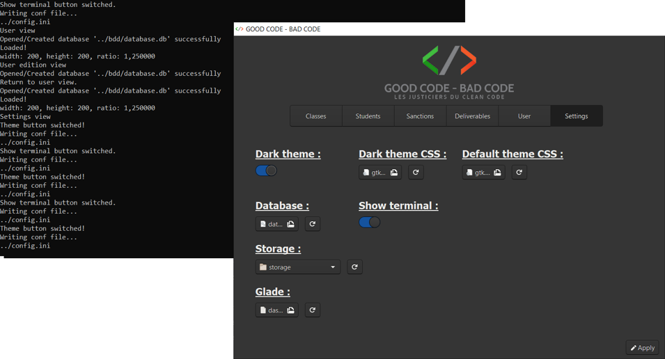

# BAD CODE

|  |  |  |  |  |
|:--------------------------------------------------------------------------:|:--------------------------------------------------------------------------:|:--------------------------------------------------------------------------:|:--------------------------------------------------------:|:---------------------------------------------------------------:|

## Table of contents

- [Description](#description)
  - [Features](#features)
    - [Navigation](#navigation)
    - [1. Classes management](#1-classes-management)
    - [2. Students management](#2-students-management)
    - [3. Sanctions management](#3-sanctions-management)
    - [4. Deliverables management](#4-deliverables-management)
    - [5. User interface](#5-user-interface)
    - [6. Settings](#6-settings)
- [Usage](#usage)
  - [1. Navigate between the sections](#1-navigate-between-the-sections)
  - [2. Classes](#2-classes)
    - [a. Consult the classes list](#a-consult-the-classes-list)
    - [b. Create class](#b-create-class)
    - [c. Edit class](#c-edit-class)
    - [d. Delete class](#d-delete-class)
    - [e. Refresh classes list](#e-refresh-classes-list)
  - [3. Students](#3-students)
    - [a. Consult the students list](#a-consult-the-students-list)
    - [b. Create student](#b-create-student)
    - [c. Edit student](#c-edit-student)
    - [d. Delete student](#d-delete-student)
    - [e. Refresh students list](#e-refresh-students-list)
  - [4. Sanction](#4-sanction)
    - [a. Consult the sanctions list](#a-consult-the-sanctions-list)
    - [b. Create sanction](#b-create-sanction)
    - [c. Edit sanction](#c-edit-sanction)
    - [d. Delete sanction](#d-delete-sanction)
    - [e. Refresh sanctions list](#e-refresh-sanctions-list)
  - [5. Deliverables](#5-deliverables)
    - [a. Consult the deliverables list](#a-consult-the-deliverables-list)
    - [b. Create deliverable](#b-create-deliverable)
    - [c. Edit deliverable](#c-edit-deliverable)
    - [d. Delete deliverable](#d-delete-deliverable)
    - [e. Refresh deliverable list](#e-refresh-deliverable-list)
  - [6. User](#6-user)
    - [a. View user's information](#a-view-users-information)
    - [b. Update user](#b-update-user)
  - [7. Settings](#7-settings)
    - [a. Consult current settings](#a-consult-current-settings)
    - [b. Update settings](#b-update-settings)
- [Installation](#installation)
  - [Using setup file](#using-setup-file)
  - [Cmake compilation](#cmake-compilation)
  - [Warning :warning: :warning: :warning: !!!](#warning----)
    - [Using msys2:](#using-msys2-)
- [Contributing](#contributing)
- [Authors](#authors)
- [More Documentation](#more-documentation)
  - [Header files](#header-files)
  - [Guides](#guides)
  - [ThreeView](#threeview)
  - [SQLite](#sqlite)

## Description

This application was made for a professor in IT development. This one
was tired of correcting badly written code so he decided to impose
sanctions on those not respecting good programming practices.

This application is therefore used to manage several classes with
different types of sanctions in order to manage all of this.

### Features

#### Navigation

| Feature                             | Detail                                                     |
|:------------------------------------|:-----------------------------------------------------------|
| Navigation between the six headings | Navigation bar: Displays the default view of each section. |

#### 1. Classes management

| Feature                           | Detail                                                                                                                                                                                                                        |
|:----------------------------------|:------------------------------------------------------------------------------------------------------------------------------------------------------------------------------------------------------------------------------|
| Displaying the list of classes    | Default view, table of 6 columns: <br> • Name <br> • Year <br> • Apprenticeship or not <br> • Specialization <br> • User <br> • Sanction affiliated to the class                                                              |
| Displaying the creation view      | Switch between classes list view and class creation.                                                                                                                                                                          |
| Creation                          | Form with 6 fields : <br>• Name: text field • Year: text field (4 digit) <br>• Rhythm: check box if apprentice class <br>• Specialization: text field <br>• Sanction: drop-down list <br>• User: drop-down list               |
| Back to the list from creation    | Two way to go back: <br>• Submit: add to the database <br>• Return: cancel the current process                                                                                                                                |
| Displaying the edit view          | Switch between classes list view and class edition.                                                                                                                                                                           |
| Edition                           | Pre-filled form with 6 fields: <br>• Name: text field <br>• Year: text field (4 digit) <br>• Rhythm: check box if apprentice class <br>• Specialization: text field <br>• Sanction: drop-down list <br>• User: drop-down list |
| Back to the list from the edition | Two way to go back: <br>• Submit: update in the database <br>• Return: cancel the current process                                                                                                                             |
| Deletion                          | Remove a class from database.                                                                                                                                                                                                 |
| Refreshing the list               | Refresh classes list.                                                                                                                                                                                                         |

#### 2. Students management

| Feature                              | Detail                                                                                                                                                                                                                 |
|:-------------------------------------|:-----------------------------------------------------------------------------------------------------------------------------------------------------------------------------------------------------------------------|
| Displaying the list of students      | Default view, table of 6 columns: <br>• First name <br>• Last name <br>• E-mail <br>• Total of "bad code" <br>• Total of champagne bottles :champagne: <br>• Class                                                     |
| Search bar                           | Search on the first name in the list, select the first result corresponding to the search.                                                                                                                             |
| Add a bottle :champagne: in total    | Add one bottle :champagne: to one student.                                                                                                                                                                             |
| Remove a bottle :champagne: in total | Remove one bottle :champagne: to one student.                                                                                                                                                                          |
| Displaying the creation view         | Switch between students list view and student creation.                                                                                                                                                                |
| Creation                             | Form with 5 fields: <br>• First name: text field <br>• Last name: text field <br>• E-mail: text field <br>• Class: drop-down list <br>• Profile photo: file browser                                                    |
| Back to the list from creation       | Two way to go back: <br>• Submit: add to the database <br>• Return: cancel the current process                                                                                                                         |
| Displaying the edit view             | Switch between students list view and student edition.                                                                                                                                                                 |
| Edition                              | Pre-filled form with 6 fields: <br>• First name: text field <br>• Last name: text field <br>• E-mail: test field <br>• Total bottles: text field <br>• Class: drop-down list <br>• Photo: image display + file browser |
| Back to the list from the edition    | Two way to go back: <br>• Submit: update in the database <br>• Return: cancel the current process                                                                                                                      |
| Deletion                             | Remove a student from database.                                                                                                                                                                                        |
| Add one deliverable                  | Add new deliverable to a student.                                                                                                                                                                                      |
| Refreshing the list                  | Refresh students list.                                                                                                                                                                                                 |

#### 3. Sanctions management

| Feature                           | Detail                                                                                                         |
|:----------------------------------|:---------------------------------------------------------------------------------------------------------------|
| Displaying the list of sanctions  | Default view, table of 3 columns: <br>• Name <br>• Description <br>• User                                      |
| Displaying the creation view      | Switch between sanctions list view and sanction creation.                                                      |
| Creation                          | Form with 3 fields: <br>• Name: text field <br>• Description: text field <br>• User: drop-down list            |
| Back to the list from creation    | Two way to go back: <br>• Submit: add to the database <br>• Return: cancel the current process                 |
| Displaying the edit view          | Switch between sanctions list view and sanction edition.                                                       |
| Edition                           | Pre-filled form with 3 fields: <br>• Name: text field <br>• Description: text field <br>• User: drop-down list |
| Back to the list from the edition | Two way to go back: <br>• Submit: update in the database <br>• Return: cancel the current process              |
| Deletion                          | Remove a sanction from database.                                                                               |
| Refreshing the list               | Refresh sanctions list.                                                                                        |

#### 4. Deliverables management

| Feature                             | Detail                                                                                                                                                                                                                                                                                                                                                                    |
|:------------------------------------|:--------------------------------------------------------------------------------------------------------------------------------------------------------------------------------------------------------------------------------------------------------------------------------------------------------------------------------------------------------------------------|
| Displaying the list of deliverables | Default view, table of 8 columns: <br>• Due date <br>• Subject <br>• Audio recording (yes / no) <br>• Video recording (yes / no) <br>• Code file (yes / no) <br>• Other deliverable file (yes / no) <br>• Status <br>• Student                                                                                                                                            |
| Search bar                          | Search on the name in the list, select the first result corresponding to the search.                                                                                                                                                                                                                                                                                      |
| Displaying the creation view        | Switch between deliverables list view and deliverables creation.                                                                                                                                                                                                                                                                                                          |
| Creation                            | Display of the student's name, the name of the sanction affiliated to his class and his description. <br>Form with 7 fields: <br>• Subject: text field <br>• Status: drop-down list <br>• Due date: calendar <br>• Audio recording: file browser <br>• Video recording: file browser <br>• Code file: file browser <br>• Other deliverable file: file browser             |
| Back to the list from creation      | Two way to go back: <br>• Submit: add to the database <br>• Return: cancel the current process                                                                                                                                                                                                                                                                            |
| Displaying the edit view            | Switch between sanctions list view and sanction edition.                                                                                                                                                                                                                                                                                                                  |
| Edition                             | Display of the student's name, the name of the sanction affiliated to his class and his description. <br> Pre-filled form with 7 fields: <br>• Subject: text field <br>• Status: drop-down list <br>• Due date: calendar <br>• Audio recording: file browser <br>• Video recording: file browser <br>• Code file: file browser <br>• Other deliverable file: file browser |
| Back to the list from the edition   | Two way to go back: <br>• Submit: update in the database <br>• Return: cancel the current process                                                                                                                                                                                                                                                                         |
| Deletion                            | Remove a sanction from database.                                                                                                                                                                                                                                                                                                                                          |
| Refreshing the list                 | Refresh sanctions list.                                                                                                                                                                                                                                                                                                                                                   |
| Download                            | From edition, for each type of file, if a file is associated with the deliverable, a download button appears.                                                                                                                                                                                                                                                             |

#### 5. User interface

| Feature                              | Detail                                                                                                                                                                                                         |
|:-------------------------------------|:---------------------------------------------------------------------------------------------------------------------------------------------------------------------------------------------------------------|
| User information display             | Default view, 5 fields: <br>• First name: text field <br>• Last name: text field <br>• E-mail: text field <br>• Date of birth: label cannot be modified <br>• Photo with file browser for instant modification |
| Displaying the edit view             | Switch between user view and user edition.                                                                                                                                                                     |
| Edition                              | Pre-filled form with 4 fields: <br>• First name: text field <br>• Last name: text field <br>• E-mail: text field <br>• Date of birth: label cannot be changed                                                  |
| Back to information from the edition | Two way to go back: <br>• Submit: update in the database <br>• Return: cancel the current process                                                                                                              |

#### 6. Settings

| Feature                     | Detail                                                                                                                                                                                                                                                                                                                                                |
|:----------------------------|:------------------------------------------------------------------------------------------------------------------------------------------------------------------------------------------------------------------------------------------------------------------------------------------------------------------------------------------------------|
| Display of current settings | Default view, 7 editable settings: <br>• Dark theme: switch button (instant update) <br>• CSS file of the dark theme: file browser <br>• CSS file of the default theme: file browser <br>• Database file: file browser <br>• Data backup folder: folder browser <br>• Glade file: file browser <br>• Terminal display: switch button (instant update) |
| Update settings             | Apply changes in conf file.                                                                                                                                                                                                                                                                                                                           |


## Usage

### 1. Navigate between the sections

To access a specific section, click on the corresponding button on the
menu bar, under the application logo.


### 2. Classes

#### a. Consult the classes list

The list of existing classes is the default view of the section. For
each of the classes, we can see in the table:
- Her name
- The year of graduation
- Apprenticeship status
- The specialisation
- The name of the user who created it
- The associated sanction

By clicking on the name of a column, it is then possible to sort this
list in alphabetical or reverse alphabetical order.


#### b. Create class

To create a class, click on the "Create" button at the bottom of the
window. A form appears, allowing you to add the necessary information:
- His name: required field
- Year of diploma: 4 required digit
- Apprenticeship status
- The specialisation
- The name of the user who created it
- The associated sanction

To submit creation, click on the "Submit" button at the bottom of the
page. To cancel, click on the "Return" button. In both cases, the list
of classes is then displayed.  
In case of validation of the creation, the new class will be present in
the list.


#### c. Edit class

To update a class and access the edit interface, two solutions are
possible: double-click on the desired line, or select it the first time
with a single click, then press the Enter key.  
The edit interface is displayed: it is very similar to the creation
interface, except that the fields are pre-filled with the current
information of the selected class.


#### d. Delete class

To delete a class, you must first select it, then click the "Delete"
button at the bottom of the window.

#### e. Refresh classes list

To refresh the classes list, click on the "Refresh" button at the bottom
of the window.

### 3. Students

#### a. Consult the students list

The list of existing students is the default view of the section. For
each student, we can see in the table:
- His first name
- Her name
- His e-mail address
- His total bad codes
- The number of bottles of champagne he must give as an offering
- His class

By clicking on the name of a column, it is then possible to sort this
list in alphabetical or reverse alphabetical order.  
A search bar is also available on the left of the menu, allowing you to
perform a search on first names: the first line corresponding to the
search is then selected.


#### b. Create student

To create a student, click on the "Create" button at the bottom of the
window. A form appears, allowing you to add the necessary information:
- His first name: compulsory
- His name: compulsory
- His e-mail address: mandatory
- His class
- His profile photo: only image formats are accepted.

The profile photo can be added from this interface using the file
browser: a copy of the original photo will then be saved in a specific
folder in the application. Once the file selected, it is then possible
to click on the button with a cross allowing to cancel the choice. If no
profile photo is selected, a default image will be assigned.  
To submit creation, click on the "Submit" button at the bottom of the
page. To cancel, click on the "Return" button. In both cases, the list
of students is then displayed: in case of submmit of the creation, the
new student will be present in the list.


#### c. Edit student

To update a student and access the edit interface, two solutions are
possible: double click on the desired line, or select it the first time
with a single click, then press the Enter key.  
The edit interface is then displayed: this is similar to the creation
interface, with the difference that the fields are pre-filled with the
current information of the selected student, the resized photo of the
student is displayed.  
A text field allows manual modification of the number of champagne
bottles :champagne:. It is also possible to change this number directly
via the student list: to do this, select the appropriate line then click
on the "+ Bottle":champagne: or "- Bottle":champagne: buttons (the
number of bottles :champagne: cannot be negative).


#### d. Delete student

To delete a student, you must first select their line, then click on the
"Delete" button at the bottom of the window.  
All the files and folders associated with this student (photos,
deliverables, etc.) are then deleted.

#### e. Refresh students list

To refresh the students list , click on the "Refresh" button at the
bottom of the window.

### 4. Sanction

#### a. Consult the sanctions list

The list of existing sanctions is the default display of the section.
For each of the sanctions, we can see in the table:
- Her name
- Its description
- The name of the user who created it

By clicking on the name of a column, it is then possible to sort this
list in alphabetical or reverse alphabetical order.


#### b. Create sanction

To create a sanction, click on the "Create" button at the bottom of the
window. A form appears, allowing you to add the necessary information:
- His name (required)
- Its description (required)
- The user who created it


#### c. Edit sanction

To update a sanction and access the edit interface, two solutions are
possible: double-click on the desired line, or select it the first time
with a single click, then press the Enter key.  
The edit interface is then displayed: it is in all respects similar to
the creation interface, with the difference that the fields are
pre-filled with the current information for the selected sanction.


#### d. Delete sanction

To delete a sanction, you must first select its line, then click on the
"Delete" button at the bottom of the window.

#### e. Refresh sanctions list

To refresh the sanctions list , click on the "Refresh" button at the
bottom of the window.

### 5. Deliverables

#### a. Consult the deliverables list

The list of existing deliverables is the default view of the section.
For each of the deliverables, we can see in the table:

- Its scheduled delivery date
- His subject
- If there is, or not an audio recording
- If there is, or not a video recording
- If there is, or not a bad code file
- If there is, or not another type of file (PDF, PowerPoint, Word,
  Archive…)
- Its status: "pending", "finished", ...
- The concerned student

By clicking on the name of a column, it is then possible to sort this
list in alphabetical or reverse alphabetical order.  
A search bar is also available on the left of the menu, allowing you to
perform a search on the names of the students. The first line
corresponding to the search is then selected.


#### b. Create deliverable

To create a deliverable, you must first be on the list of students,
select the line of the student concerned then click on the "Add
deliverable" button.  
A form appears, it recalls the non-modifiable information (the name of
the student, the name of the sanction associated with his class and the
description of it) and allows you to add the necessary information:

- Its subject: required
- Its status: "pending", "finished", ...
- Its scheduled delivery date
- An audio file: only audio formats are accepted
- A video file: only video formats are accepted
- A bad code file
- Another type of file

Once a file is selected, it is then possible to click on the button with
a cross allowing to cancel the choice. Otherwise, a copy of the original
files will then be saved in a folder specific to the application.  
To submit creation, click on the "Submit" button at the bottom of the
page. To cancel, click on the "Return" button. In both cases, the list
of deliverables is then displayed.  
In case of validation of the creation, the new deliverable will be
present in the list.


#### c. Edit deliverable

To update a deliverable and access the edit interface, two solutions are
possible: double-click on the desired line, or select it the first time
with a single click, then press the Enter key. The edit interface is
then displayed.  
It is in all respects similar to the creation interface, with the
difference that the fields are pre-filled with the current information
for the selected sanction.  
In addition, if a file is already associated with the deliverable, it is
then possible to download a copy at the location chosen by the user via
the download interface.


#### d. Delete deliverable

To delete a deliverable, you must first select its line, then click on
the "Delete" button at the bottom of the window.

#### e. Refresh deliverable list

To refresh the deliverables list , click on the "Refresh" button at the
bottom of the window.

### 6. User

#### a. View user's information

User's information is the default view of the topic and consists of five
fields:
- His first name
- Her name
- His email
- His date of birth
- His profil picture

His profil picture can be modified directly from this interface: only
image formats are accepted. If a photo is added, a copy of the original
photo will then be saved in a folder specific to the application, and
the new image will be directly displayed at the correct size.


#### b. Update user

To access the user edit interface, click on the "Edit" button: the edit
interface is displayed, allowing you to modify the three required
information (first name, last name and e-mail) .  
The date of birth is obviously not changeable :nerd_face: :champagne:
:100:


### 7. Settings

#### a. Consult current settings

The settings section displays the global variables of the application,
located in the configuration file:
- The current theme (dark or classic)
- The CSS file of the dark theme
- The CSS file of the classic theme
- The database file
- The application data backup folder
- The Glade file
- If the console is displayed or not


#### b. Update settings

The update of the settings values is done directly from the display page
with:
- A "switch" button: to apply or not the dark theme and to display or
  not the console
- A folder browser: for the backup folder of the application data
- File browser: for other files

When a file or folder is selected, it is possible to cancel this
selection and return to the initial value (the one present in the
configuration file) using the "Reset" button located next to each file
selector. To submit the new values and write them on the configuration
file (saving them for the next opening of the application), click on the
"Apply" button. In fact, if the switch buttons directly display the
result of their value (allowing dynamic juggling between themes), the
others will only be saved by clicking on the "Apply" button.




## Installation

### Using setup file

You can install this application with the setup file located here :
[bad_code_setup.exe](installation/bad_code_setup.exe)

### Cmake compilation

Or compile it with the [CMakeLists](CMakeLists.txt)

### Warning :warning: :warning: :warning: !!!

In both case, you will need to have mingw installed with gtk+3.20 at
least.  
I didn't figured out yet how to compile it in static in all-in-one
executable file...

#### Using [msys2](https://www.msys2.org/) :

Here's the command to execute inside [msys2](https://www.msys2.org/) to
be able to compile this project :

```bash
pacman -Syu
pacman -S mingw-w64-x86_64-gcc
pacman -S mingw-w64-x86_64-gtk3
```

Then, you need to link the `msys2/mingw64/bin` folder to your `system
environment variable PATH`

During the build, if some libraries are not found, go to the folder
`msys2/mingw64/include` and copy them outside of there *version
folder*:\ **Exemple :** copy **gtk** and **gdk** folder inside
`msys2/mingw64/include/gtk-3-0/` directly inside
`msys2/mingw64/include/`

## Contributing

If someone has the idea and know how to compile in static with GTK and
stuffs to be dependance free on windows OS, be my guest !

## Authors

This project was carried out in a group of two people, myself included.

|                                                      |                                                             |
|:-----------------------------------------------------|:-----------------------------------------------------------:|
| [Joëlle CASTELLI](https://github.com/JoelleCastelli) |  |
| [Noé LARRIEU-LACOSTE](https://github.com/Nouuu)      |           |


## More Documentation

Here's some stuff I looked at when I was developing this application :

#### Header files

[https://www.tutorialspoint.com/cprogramming/c_header_files.htm](https://www.tutorialspoint.com/cprogramming/c_header_files.htm)

#### Guides

[https://gerald3d.developpez.com/tutoriels/gtk/glade3/](https://gerald3d.developpez.com/tutoriels/gtk/glade3/)\
[https://openclassrooms.com/fr/courses/1343806-pygtk/1343942-glade](https://openclassrooms.com/fr/courses/1343806-pygtk/1343942-glade)\
[https://www.guillaumeriviere.name/estia/DRI/tp1.php](https://www.guillaumeriviere.name/estia/DRI/tp1.php)

#### ThreeView

[https://linuxfr.org/users/trim/journaux/utilisation-de-gtktreemodel-gtktreeview-et-consorts](https://linuxfr.org/users/trim/journaux/utilisation-de-gtktreemodel-gtktreeview-et-consorts)
[https://gtk.developpez.com/cours/gtk2/?page=page_23](https://gtk.developpez.com/cours/gtk2/?page=page_23)


#### SQLite

[http://zetcode.com/db/sqlitec/](http://zetcode.com/db/sqlitec/)
